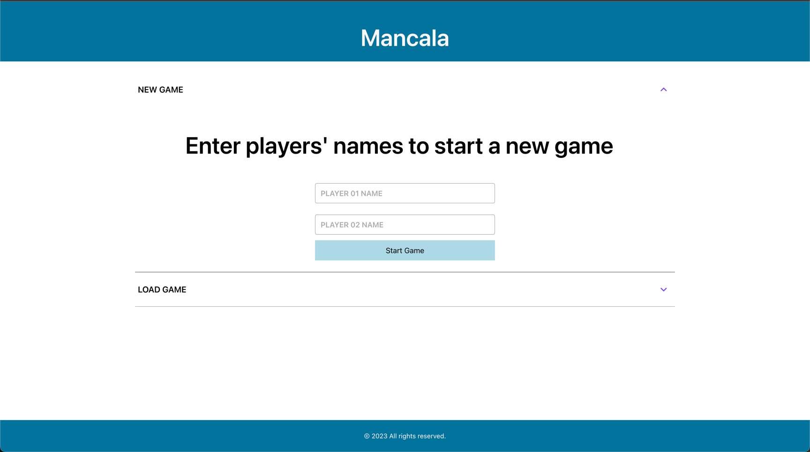
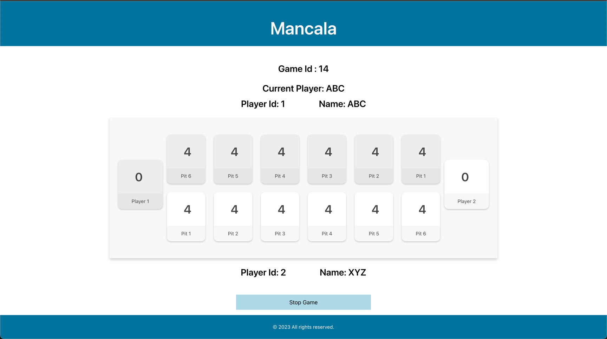

#  Mancala UI

Along with React.js I used:
1. Grommet design components
2. Docker to containerize the application 
3. Docker Compose is used to run the application. 
4. Nginx web server to serve the application in production mode.

### Pre-requisites to run the application in local environment
1. Node.js (I used v18.17.1)

### Pre-requisites to run the application with Docker
1. Docker installed (I used Docker Desktop for Mac)

## How to run the frontend application in local dev mode?
1. Unzip the frontend file
2. Go to the frontend folder (root) or open it with your favorite IDE (or open it in terminal/cmd)
3. Run the following on terminal / cmd:

```bash
yarn install
```
```bash
yarn start
```
For a DEV server, navigate to [`http://localhost:3000/`](http://localhost:3000/)

## How to run the frontend application with docker compose?
1. Unzip the frontend file
2. Go to the frontend folder (root) or open it with your favorite IDE
3. Run the following commands

```bash
docker-compose up --build -d
```

For a PROD server, navigate to [`http://localhost:8088/`](http://localhost:8088/)

###### To stop the front end application, run the following command:
```bash
docker-compose down
```

## Future Improvements to the UI:
1. Add  a login page & secure the application.
2. Use socket.io to play the game in real time with another player.


## Screenshots of the UI:
Game Start:



Game Play:



### _Thanks for reading this far. I hope you enjoyed it :)_
